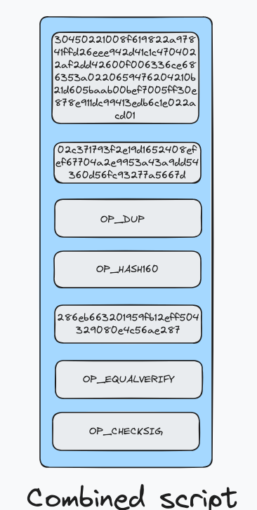

## How I approach my summer of Bitcoin assignment.

I divided my whole approach into the following sub-tasks.

1. Defining the scope of the whole assignment.
2. Understanding the Mempool provided to us.
3. Understanding the basic structure of a transaction on a BTC network.
4. Understanding how Bitcoin scripts are evaluated.
5. Evaluating different scripts and how to evaluate each of them.
6. Deriving my approach on how to pick transactions from the Mempool to maximise the fee.
7. Creating block header.
8. Creating coinbase Tx.
9. Mining a block.

## DEFINING THE SCOPE OF THE WHOLE ASSIGNMENT

I figured out that to verify any transaction on the BTC network we must fulfill these 3 conditions.

- The input transaction must be a part of a BTC current chain UTXO set.
- The sum of all inputs should be greater than the sum of all outputs.
- The unlocking script of each input must unlock the locking script of the same.

Other than this we have some minor checks that we need to perform so that the weight of each Tx should not exceed the max weigth of the block, and many such check that we will discuss later in the documentation.

So in the docs, I will discuss each of the steps in detail so let's get started.

## UNDERSTANDING THE MEMPOOL PROVIDED TO US.

My first step was to understand what I need to do as a part of my assignment, so I ran a small script to identify the differnt types of script in the whole mempool.

```js
// SCRIPT TO COUNT THE NUMBER OF TRANSACTIONS OF EACH SCRIPTPUBKEY TYPE IN THE MEMPOOL
const fs = require("fs");
const path = require("path");
const folderPath = "./mempool";

const counts = {};

function countScriptPubKeyTypes(data) {
  data.vin.forEach((transaction) => {
    const type = transaction.prevout.scriptpubkey_type;
    if (counts[type]) {
      counts[type]++;
    } else {
      counts[type] = 1;
    }
  });

  return counts;
}

fs.readdir(folderPath, async (err, files) => {
  if (err) {
    console.error("Error reading folder:", err);
    return;
  }

  const jsonFiles = files.filter(
    (file) => path.extname(file).toLowerCase() === ".json"
  );

  for (const jsonFile of jsonFiles) {
    const filePath = path.join(folderPath, jsonFile);

    try {
      const data = await fs.promises.readFile(filePath, "utf8");
      const jsonData = JSON.parse(data);

      countScriptPubKeyTypes(jsonData);
    } catch (err) {
      console.error("Error reading file:", filePath, err);
    }
  }
});
```

**OUTPUT**
{
v0_p2wpkh: 13807,
v1_p2tr: 5800,
p2pkh: 1401,
v0_p2wsh: 8854,
p2sh: 3672
}

Note: P2TR was out of the scope of the assignment.

## UNDERSTANDING THE BASIC STRUCTURE OF A BITCOIN TRANSACTION.

Now I started by understanding the basic structure of a bitcoin transaction.

- Every Tx has a list of inputs and outputs and each input has a ref to the unspent Bitcoin output from previous transaction on the block.
- Contains a version field.
- Contains a lock time field.

Let's examine a basic legacy transaction

```json
{
  "version": 2,
  "locktime": 0,
  "vin": [
    {
      "txid": "fb7fe37919a55dfa45a062f88bd3c7412b54de759115cb58c3b9b46ac5f7c925",
      "vout": 1,
      "prevout": {
        "scriptpubkey": "76a914286eb663201959fb12eff504329080e4c56ae28788ac",
        "scriptpubkey_asm": "OP_DUP OP_HASH160 OP_PUSHBYTES_20 286eb663201959fb12eff504329080e4c56ae287 OP_EQUALVERIFY OP_CHECKSIG",
        "scriptpubkey_type": "p2pkh",
        "scriptpubkey_address": "14gnf7L2DjBYKFuWb6iftBoWE9hmAoFbcF",
        "value": 433833
      },
      "scriptsig": "4830450221008f619822a97841ffd26eee942d41c1c4704022af2dd42600f006336ce686353a0220659476204210b21d605baab00bef7005ff30e878e911dc99413edb6c1e022acd012102c371793f2e19d1652408efef67704a2e9953a43a9dd54360d56fc93277a5667d",
      "scriptsig_asm": "OP_PUSHBYTES_72 30450221008f619822a97841ffd26eee942d41c1c4704022af2dd42600f006336ce686353a0220659476204210b21d605baab00bef7005ff30e878e911dc99413edb6c1e022acd01 OP_PUSHBYTES_33 02c371793f2e19d1652408efef67704a2e9953a43a9dd54360d56fc93277a5667d",
      "is_coinbase": false,
      "sequence": 4294967295
    }
  ],
  "vout": [
    {
      "scriptpubkey": "76a9141ef7874d338d24ecf6577e6eadeeee6cd579c67188ac",
      "scriptpubkey_asm": "OP_DUP OP_HASH160 OP_PUSHBYTES_20 1ef7874d338d24ecf6577e6eadeeee6cd579c671 OP_EQUALVERIFY OP_CHECKSIG",
      "scriptpubkey_type": "p2pkh",
      "scriptpubkey_address": "13pjoLcRKqhzPCbJgYW77LSFCcuwmHN2qA",
      "value": 387156
    },
    {
      "scriptpubkey": "76a9142e391b6c47778d35586b1f4154cbc6b06dc9840c88ac",
      "scriptpubkey_asm": "OP_DUP OP_HASH160 OP_PUSHBYTES_20 2e391b6c47778d35586b1f4154cbc6b06dc9840c OP_EQUALVERIFY OP_CHECKSIG",
      "scriptpubkey_type": "p2pkh",
      "scriptpubkey_address": "15DQVhQ7PU6VPsTtvwLxfDsTP4P6A3Z5vP",
      "value": 37320
    }
  ]
}
```

As we can see the above transaction contains:

- 1 input that uses P2PKH legacy script. (vin)
- 2 outputs (vout)
- version 2
- lock time 0

If we try to check whether a tx satisfies our 2 check where the sum of input > sum of output.

We can check here that the same
Sum of inputs = 433833
Sum of outputs = 387156 + 37320 = 424476

We can see that inputs > outputs, which tells us that this check for the transaction is valid.

<span style=" color:black;background-color:lightblue">Also, the difference between the inputs and outputs in the fee goes to the miner. More on this later when we understand how to mine a block.
I will answer all your doubts!!
</span>

```json
{
  "txid": "fb7fe37919a55dfa45a062f88bd3c7412b54de759115cb58c3b9b46ac5f7c925",
  "vout": 1,
  "prevout": {
    "scriptpubkey": "76a914286eb663201959fb12eff504329080e4c56ae28788ac",
    "scriptpubkey_asm": "OP_DUP OP_HASH160 OP_PUSHBYTES_20 286eb663201959fb12eff504329080e4c56ae287 OP_EQUALVERIFY OP_CHECKSIG",
    "scriptpubkey_type": "p2pkh",
    "scriptpubkey_address": "14gnf7L2DjBYKFuWb6iftBoWE9hmAoFbcF",
    "value": 433833
  },
  "scriptsig": "4830450221008f619822a97841ffd26eee942d41c1c4704022af2dd42600f006336ce686353a0220659476204210b21d605baab00bef7005ff30e878e911dc99413edb6c1e022acd012102c371793f2e19d1652408efef67704a2e9953a43a9dd54360d56fc93277a5667d",
  "scriptsig_asm": "OP_PUSHBYTES_72 30450221008f619822a97841ffd26eee942d41c1c4704022af2dd42600f006336ce686353a0220659476204210b21d605baab00bef7005ff30e878e911dc99413edb6c1e022acd01 OP_PUSHBYTES_33 02c371793f2e19d1652408efef67704a2e9953a43a9dd54360d56fc93277a5667d",
  "is_coinbase": false,
  "sequence": 4294967295
}
```

Now let's examine a single input object and understand what a TxInput contains

- Txid => It refers to the prevTx that we are spending in this Tx.
- Vout => Metadata
- Prevout => Now here we are given the reference to the whole previous transaction. In a real scenario, we fetch the Tx based on the txid in the json object.
- ScriptPubKey => Refers to the locking script via which the bitcoins have been locked on the network.
  -CoinbaseFlag => Boolean flag that decides whether this is a coinbaseTx or not.
- Sequence => It gives control to us on deciding when to pick data from the mempool and try to mine it in a block.

So now I created basic classes and constructors for Tx , TxIn and TxOut.

```js
// Transaction class
export class Tx {
  public version: bigint;
  public readonly txIns: TxIn[];
  public readonly txOuts: TxOut[];
  public locktime: bigint;
  public segwit: boolean;

  private _hashPrevouts: Buffer;
  private _hashSequence: Buffer;
  private _hashOutputs: Buffer;

  constructor(
    version: bigint = 1n,
    txIns: TxIn[] = [],
    txOuts: TxOut[] = [],
    locktime: bigint = 0n,
    segwit: boolean = false
  ) {
    this.version = version;
    this.txIns = txIns;
    this.txOuts = txOuts;
    this.locktime = locktime;
    this.segwit = segwit;
  }
}

// TxIn class


// TxOut class


```

## UNDERSTANDING HOW BITCOIN SCRIPTS ARE EVALUATED

Bitcoin scripts are evaluated by placing each commands in the stack and then executing each command on the stack.

Now let us understand how to de we validate the biitcoin scripts,if after the execution the top element on the stack is a truthy value we consider the script to be valid.

In bitcoin input, we have one locking and one unlocking script and then we combine both scripts and then execute the script to validate the scripts.

```js
const scriptSig = [
  "OP_PUSHBYTES_72",
  "30450221008f619822a97841ffd26eee942d41c1c4704022af2dd42600f006336ce686353a0220659476204210b21d605baab00bef7005ff30e878e911dc99413edb6c1e022acd01",
  "OP_PUSHBYTES_33",
  "02c371793f2e19d1652408efef67704a2e9953a43a9dd54360d56fc93277a5667d",
];

const scriptPubKey = [
  "OP_DUP",
  "OP_HASH160",
  "OP_PUSHBYTES_20",
  "286eb663201959fb12eff504329080e4c56ae287",
  "OP_EQUALVERIFY",
  "OP_CHECKSIG",
];

// Next step is to combine both the script to get the combined that we had to execute to validate the input of the transaction

// combined script = [...scriptSig, ...scriptPubKey]
```

**How our combined will look at the start of the execution**



Ans we start executing this is placing the elements in the stack and executing the same.

## UNDERSTANDING DIFFERENT SCRIPTS AND HOW TO EVALUATE EACH OF THEM.

#### Legacy scripts which include P2PKH & P2PK

Evaluating these scripts are really simple we just need to combine the scriptSig n scriptPubkey and evaluate them.

Our evaluation will be a success if we have a truthy value at the top of a stack.

We only need to calculate the messageHash(z) here to perform checkSig operation that we have in the stack.

```js
// pseudo code for getting the msg hash
const txObj = new Tx(); // Tx instance
const serializedTx = txObj.serialize();

// we double hash the serialized tx data to get the message hash for the input
const messageHash = hash256(serializedTx);
```

NOTE: But the serialize function is used is not pure serialize where serialize every part of the transaction, so now lets understand how to write our serialize function that gives us the message hash for each input of the transaction.

**Serializing for getting the message hash**

to be completed

**Now lets move to most interesting part which is verifying P2PKH scripts**

Now I have all the moving parts so now I just have to make them work together.

Steps involved in evaluating scripts:

1. I will start picking the top element from the combined script, will start executing it as it says.
   For example in the above case the first element is the data so I will insert that in the stack.
2. So after first two elements the stack will look like:


3. The third command is OP_DUP , which will be executed on the stack.

4. This process will follow until I any operation returns false or the combined script is complelty evaluated.

5. If the combined script is empty and the stack has 1 as the top element that input will be considered as valid, but if turns out to be 0 the input will be treated as invalid.

Now I can verify all transactions that use P2PKH scripts in their inputs.

NOTE: In total there are 446 P2PKH Tx and I am able to verify 440 of them , and got 21 marks.

#### P2WPKH Scripts

These scripts are very similar to P2PKH, it is even considered an extension to P2PKH scripts.

To evaluate them, we first need to extract the hash(public key) from the prevScriptPubkey and then form a p2pkhLock and serialize the whole thing and combine all parts of a tranactions to form the preimage.
Our messages-hash will be the hash256 of the preimage.

Now to evaluate the script we will first get the hash160 from the scriptPubKey and use it to construct a p2pkhLock and combine them with the witness data and evaluate as we evaluate as scripts

## DERIVING MY APPROACH ON HOW TO PICK TXs FROM THE MEMPOOL TO MAXOMISE THE FEE COLLECTED

Since very Tx has a fee and weigth associated with them, the idea was very simple that If I can pick Tx that have highest fee/weight my job will be done.

At first I thought to approach this using DP, but after writing the solution I realized the with the constraints given it is not feasible to use this approach.
So I moved to greedy approach to solve the same.

```js
const fee = [];
const weight = [];
const feePerWeight = [];

// getting the fee per weight
for (let i = 0; i < tx.length; i++) {
  feePerWeight.push(Number(fees[i]) / weights[i]);
}

// arranging the indices in the order I want so I make query easily
const sortedIndices = feePerWeight
  .map((_, i) => i)
  .sort((a, b) => feePerWeight[b] - feePerWeight[a]);

// sort the feePerWeight

// just start picking the elements from the array till the block is filled this will ensure that maxFee is collected.

// Though it can fail in giving the best fee everytime, but it ensures fee very close to the best answer possible.
```

**DOWNSIDES OF THIS APPROACH**

The only downside of this appraoch it does not gaurantee the best solution, but at the same time it ensures that we get an answer which is very close to the best solution.
Later we will see that this approach turned out pretty well in my case.

## CREATING A BLOCK HEADER

Block headers contains the metadata about the block, what transaction it holds and for what difficulty it is mined.


Block headers contains:

- version
- previous block hash
- merkle root
- time
- bits
- nonce

```js
function createBlock(merkle_root, nonce) {
  let serialize = "";
  serialize += "11000000"; // version
  serialize += (0).toString(16).padStart(64, "0"); // prev block hash
  serialize += merkle_root;
  const Time = Math.floor(Date.now() / 1000); // time
  serialize += Time.toString(16)
    .padStart(8, "0")
    .match(/../g)
    .reverse()
    .join("");
  serialize += "ffff001f"; // bits
  serialize += nonce.toString(16).padStart(8, "0"); // nonce

  return serialize;
}
```

CALCULATING THE MERKLE ROOT

```js
// step 1 -> Getting the txid for all transactions
const txid = [];

// step 2 -> adding the txid of the coinbase to the array
const txidCoinbase = "<placeholder>";
const upadtedTxidArray = [wtxidCoinbase, ...wtxid];

// step 3 -> calculating the merkle root
const merkleRoot = merkleRoot(upadtedWtxidArray);
```

---

## CREATING A COINBASE TRANSACTION

Coinbase transaction is the first transaction that goes into every block, it contains the signature for all transaction(both legacy and segwit) in the block.
This is the transaction where miner locks BTCs that he got as fee and block reward to himself, we will see how it is done.

```json
// This is a random coinbase transaction ( taken from learnmeabitcoin)
{
  "version": "01000000",
  "marker": "00",
  "flag": "01",
  "inputcount": "01",
  "inputs": [
    {
      "txid": "0000000000000000000000000000000000000000000000000000000000000000",
      "vout": "ffffffff",
      "scriptsigsize": "25",
      "scriptsig": "03233708184d696e656420627920416e74506f6f6c373946205b8160a4256c0000946e0100",
      "sequence": "ffffffff"
    }
  ],
  "outputcount": "02",
  "outputs": [
    {
      "amount": "f595814a00000000",
      "scriptpubkeysize": "19",
      "scriptpubkey": "76a914edf10a7fac6b32e24daa5305c723f3de58db1bc888ac"
    },
    {
      "amount": "0000000000000000",
      "scriptpubkeysize": "26",
      "scriptpubkey": "6a24aa21a9edfaa194df59043645ba0f58aad74bfd5693fa497093174d12a4bb3b0574a878db"
    }
  ],
  "witness": [
    {
      "stackitems": "01",
      "0": {
        "size": "20",
        "item": "0000000000000000000000000000000000000000000000000000000000000000"
      }
    }
  ],
  "locktime": "00000000"
}
```

LET'S STUDY A COINBASE TX  
This is a setwit coinbase transaction since it has a flag and maker
It has 1 input with txid of 0.
The most important part is outputs which contains 2 outputs

- One where the miner locks the block reward to himself
- Second which contains witness commitment which act as a signature for all Txs in the block

CREATING MY OWN COINBASE TRANSACTION

```js
  public static createCoinbaseTransaction(witnessCommitment: any): string {
    let coinbaseTx = "";
    coinbaseTx += "01000000"; // version
    coinbaseTx += "00"; // flag
    coinbaseTx += "01"; // marker
    coinbaseTx += "01"; // in count
    coinbaseTx +=
      "0000000000000000000000000000000000000000000000000000000000000000";
    coinbaseTx += "ffffffff";
    coinbaseTx +=
      "2503233708184d696e656420627920416e74506f6f6c373946205b8160a4256c0000946e0100";
    coinbaseTx += "ffffffff";
    coinbaseTx += "02"
    coinbaseTx += // output count
      "f595814a000000001976a914edf10a7fac6b32e24daa5305c723f3de58db1bc888ac000000000000000026";
    coinbaseTx += `6a24aa21a9ed${witnessCommitment}`; // witness commitment which I calculated
    coinbaseTx +=
      "0120000000000000000000000000000000000000000000000000000000000000000000000000";

    return coinbaseTx;
  }


```

**CALCULATING THE WITNESS COMMITMENT FOR A LIST OF TRANSACTION**

```js
// step 1 -> Getting the wtxid for all transactions
const wtxid = [];

// step 2 -> adding the wtxid of the coinbase to the array
const wtxidCoinbase =
  "0000000000000000000000000000000000000000000000000000000000000000";
const upadtedWtxidArray = [wtxidCoinbase, ...wtxid];

// step 3 -> calculating the merkle root of the upadtedWtxidArray
const witnessCommitment = merkleRoot(upadtedWtxidArray);
```

## MINING A BLOCK

Once have our block header and coinbase transaction ready, the next step is to mine a block.
Mining a block is just a brute process where we need to find a hash of the block header till the time we get one less than current diffiulty of the overall network.
And we get differnt hash every time by changing nonce field every time we find a greator hash.

```js
const DIFFICULTY =
  "0000ffff00000000000000000000000000000000000000000000000000000000";
const hash = hash256(blockHeader); // serialized block header


  mineBlock(merkleRoot: Buffer) {
    let nonce = 0;

    while (true) {
      const block = createBlock(merkleRoot.toString("hex"), nonce);
      const hash = hash256(Buffer.from(block, "hex")).reverse();

      if (difficulty.compare(hash) > 0) {
        return block;
      }

      nonce++;
    }
  }
```

Once we find a hash that is less than the difficulty, out block is mined and can be added to the blockchain, where other miner will confirm that we mined it properly.

### REFERENCES USED

**Websites**

- [Learn me a bitcoin](https://learnmeabitcoin.com)
- [Blockchain](https://blockchain.com)

**Books**

- [Programming Bitcoin by jimmy song]()
- [Mastering bitcoin]()
- [Grokking bitcoin]()
